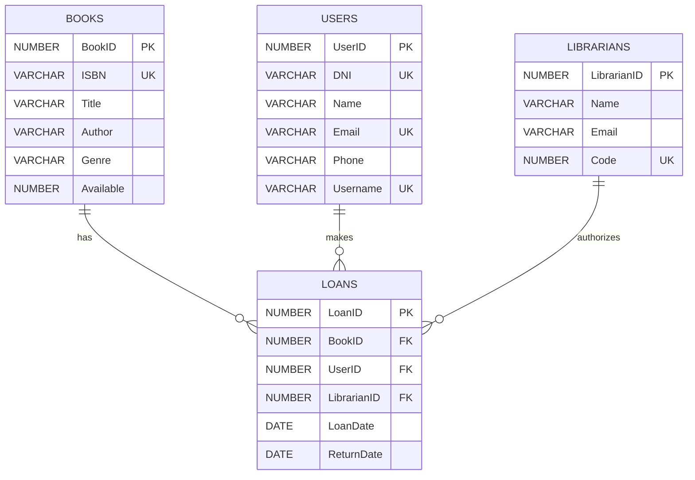

# Copilot Public Library.

This Entity-Relationship diagram represents the initial database that will be used for this PL/SQL hands-on.

It consists of four tables that represent the following:

- **Users**: These are the users of the library who perform book returns and loans.

- **Books**: These are the text documents that the library can loan.

- **Librarians**: These are the library workers responsible for performing/authorizing loans.

- **Loans**: This is a relational entity that represents the action of loaning a book to a user.

> **Warning**
>
> This structure is the initial structure of the database. Throughout the hands-on, slight modifications will be made.

