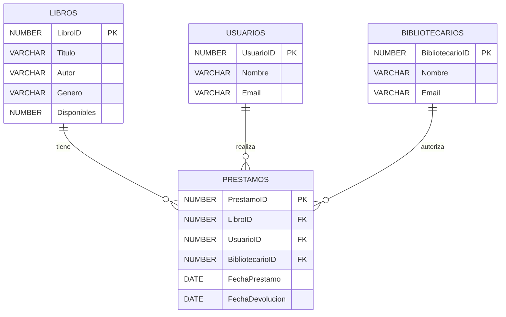

# Bilioteca Publica Copilot.

Este diagrama presenta un pequeño modelo entidad relacion el cual representa la base de datos de una biblioteca publica

```mermaid
erDiagram
    LIBROS {
        NUMBER LibroID PK
        VARCHAR Titulo
        VARCHAR Autor
        VARCHAR Genero
        NUMBER Disponibles
    }
    USUARIOS {
        NUMBER UsuarioID PK
        VARCHAR Nombre
        VARCHAR Email
    }
    BIBLIOTECARIOS {
        NUMBER BibliotecarioID PK
        VARCHAR Nombre
        VARCHAR Email
    }
    PRESTAMOS {
        NUMBER PrestamoID PK
        NUMBER LibroID FK
        NUMBER UsuarioID FK
        NUMBER BibliotecarioID FK
        DATE FechaPrestamo
        DATE FechaDevolucion
    }
    LIBROS ||--o{ PRESTAMOS : "tiene"
    USUARIOS ||--o{ PRESTAMOS : "realiza"
    BIBLIOTECARIOS ||--o{ PRESTAMOS : "autoriza"

```
