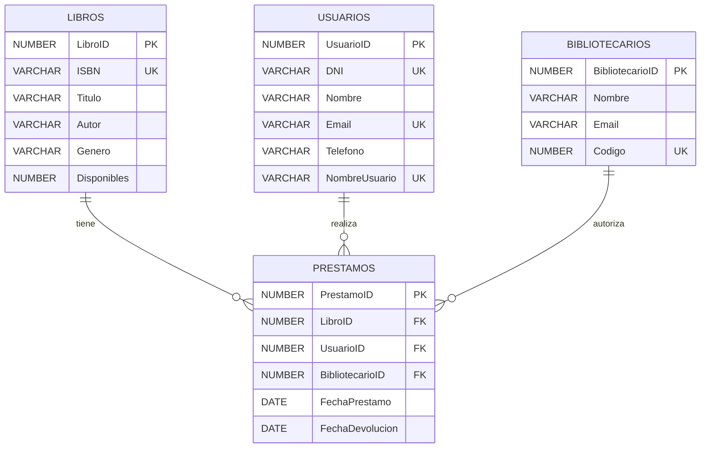

# Bilioteca Publica Copilot.

Este diagrama Entidad Relacion representa la base de datos inicial con la que se trabajara este practico PL/SQL.

Consta cuatro tablas que representan lo siguiente:

- **Usuarios**: Son usuarios de la biblioteca los cuales realizan devoluciones y prestamo de libros.

- **Libros**: Son los documentos de texto que la biblioteca puede prestar.

- **Bibliotecarios**: Son los trabajadores de la biblioteca y son las personas encargadas de realizar/autorizar prestamos.

- **Prestamos**: Es una entidad relacional que representa la accion de prestar un libro hacia un usuario.

> **Advertencia**
>
> Esta estructura es la estructura inicial de la base de datos. A lo largo del practico leves modificaciones le seran realizadas.

